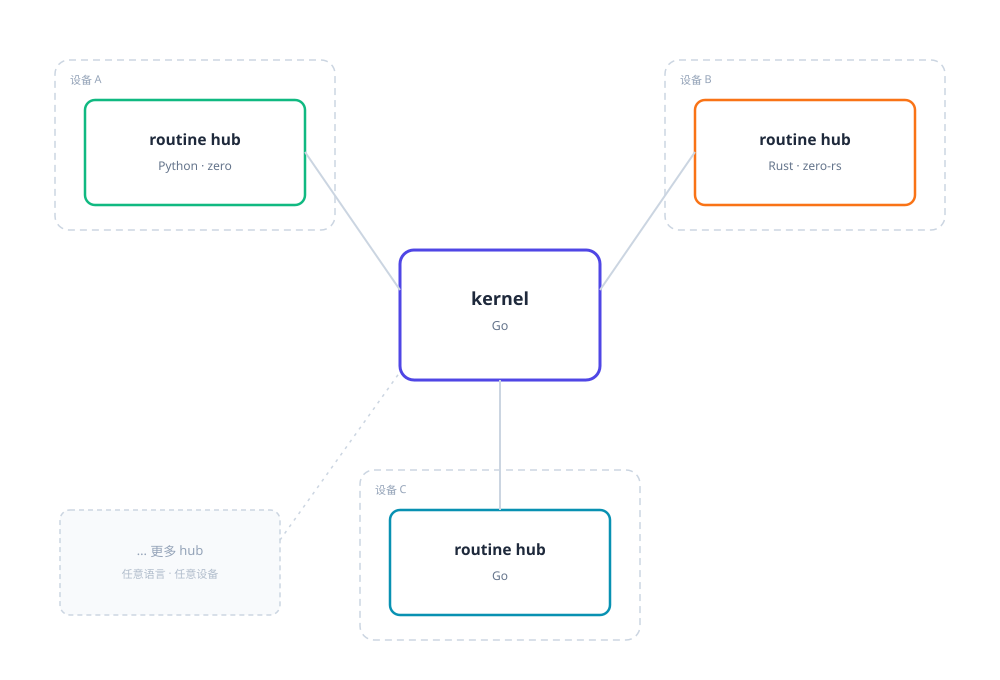

# zero-harness

Multi-language routine orchestration framework + LLM agent application skeleton.



[中文说明](README.zh.md)

## Design Philosophy

**Everything is a routine** — an agent is a routine, a tool is a routine, the web server
is a routine, even the loader and the watcher are routines. Routines can be written in
any language. Each hub is an independent process — any language, any device.

Routines are enabled/disabled via `zero/routines.yaml` (comment out an entry to disable);
hot reload applies automatically.

## Quick Start (Windows)

Prerequisites: [Go](https://golang.google.cn/dl/), [uv](https://docs.astral.sh/uv/getting-started/installation/), bun or node.

1. Copy `zero/models.yaml.example` to `zero/models.yaml` and fill in your api_key.
2. Double-click `start.bat` in the repo root.

Open <http://localhost:5173> in your browser.

## Example: Hello Routine

Create `zero/routines/user/hello.py`:

```python
from typing import Any, Dict
from routine import Routine

class Hello(Routine):
    name = 'hello'
    meta = {'description': 'Say hello to someone'}

    async def run(self, kwargs: Dict[str, Any]):
        return f"Hello, {kwargs.get('name', 'World')}!"
```

Add one line to `zero/routines.yaml` (hot reload applies it automatically):

```yaml
- routines/user/hello.py
```

Call it:

```bash
curl -X POST http://localhost:7781/run/hello -H "Content-Type: application/json" -d '{"name":"World"}'
# {"ok":true,"result":"Hello, World!"}
```

## More

- [routine-py/docs/](routine-py/docs/) — framework API and concepts
- [zero/docs/](zero/docs/) — zero project conventions and end-to-end walkthroughs
- [routine-rs/examples/](routine-rs/examples/) — Rust SDK examples
